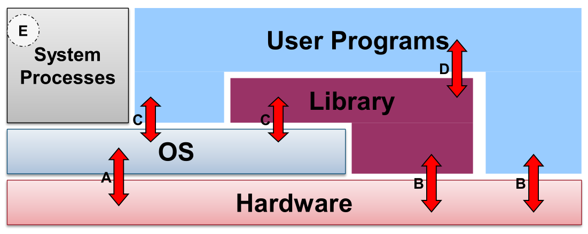

# 1 - Introduction to OS

## What is an OS

**Definition.** An OS is a program that is an intermediary between a user and computer hardware.

## Types of OS

| OS Type          | Usage                                                        | Advantages                                                   | Disadvantages                                                |
| ---------------- | ------------------------------------------------------------ | ------------------------------------------------------------ | ------------------------------------------------------------ |
| No OS            | change physical config                                       | minimal overhead                                             | not portable, not efficient use                              |
| Batch OS         | similar jobs are bundled with instructions  in a new magnetic tape that OS execs in order. | computer does more work, back-to-back (increased performance) | no protection (one job can affect  pending jobs), infinite loops, hard  to debug. w/o multiprogramming, CPU is idle during I/O (e.g. card reading). |
|                  |                                                              |                                                              |                                                              |
| Time-sharing OS  | multiple users interact with machine via  **terminal**. job scheduling mimics concurrency. | memory management, shares CPU time, memory, storage. virtualization |                                                              |
| PC OS -- Windows | Single user at once, but multiple user access                | (dedicated machine)                                          |                                                              |
| PC OS -- Unix    | One user at workstation, but others can  remote access. | (general time sharing model)                                 |                                                              |

## Motivations for OS

- Hardware components have same core functionality but different attributes (speed, storage etc.)
  - OS helps to abstract these details
  - Presents common high level functionality to user.
  - Efficiency, programmability, portability
- Multiple resources' concurrent usage
- Multiple processes concurrent exec

**OS is an abstraction.**

**OS is a resource allocator.** Manage resources and arbitrate conflicting requests.

**OS is a control program.** Prevents accidents and malicious attacks, provides security isolation and protection.

## Implementation -- High Level View

**Kernel**: complete access to hardware resources; **User**: partial access.

- **User space**: User application, User interface
- **Kernel space**: Operating system

Kernel: Deals with hardware issues, provides **system call interface**, special code for **interrupt handlers**, device **drivers**.

## Implementation -- Components

- A: OS exec machine instructions
- B: Normal exec machine instructions
- C: System calls (interface)
  - D: Program calls library code

## Implementation

Code organization:

- Machine independent HLL
- Machine dependent HLL
- Machine dependent assembly code

OS Structures:

|                                    | Monolithic                                      | Microkernel                           |
| ---------------------------------- | ----------------------------------------------- | ------------------------------------- |
| Size                               | Bigger                                          | Smaller                               |
| Execution                          | Fast                                            | Slow                                  |
| Extensibility                      | Highly coupled, difficult to extend             | Ease of extensibility                 |
| Security (e.g. a service crashing) | Highly coupled, may cause whole system to crash | Causes only that microkernel to crash |
| Examples                           | Unix/Win/BSD                                    | QNX, Symbian, L4Linux                 |

## Virtual Machines

OS assumes total control of hardware. So what is we want to run multiple OS on the same hardware? (e.g. Cloud computing)

Software emulation of hardware = **Virtualization** of underlying hardware (Illusion of hardware access)

**Hypervisor**/VMM

- Type 1: Runs directly on hardware.
  - Provides indiv virtual machines to multiple guest OSes
- Type 2: Runs as a program on a Host OS (e.g. VirtualBox).