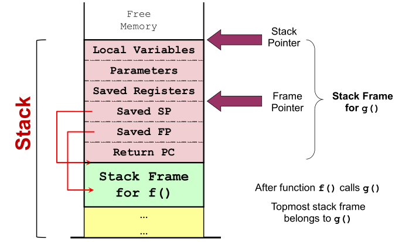
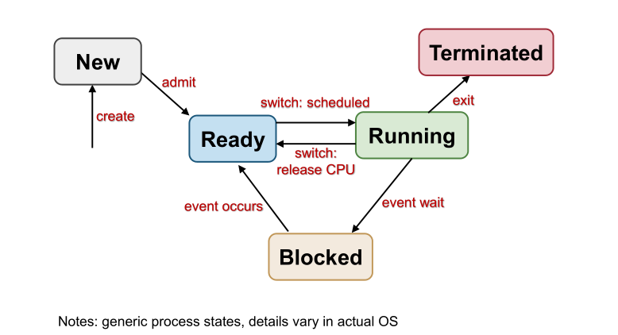
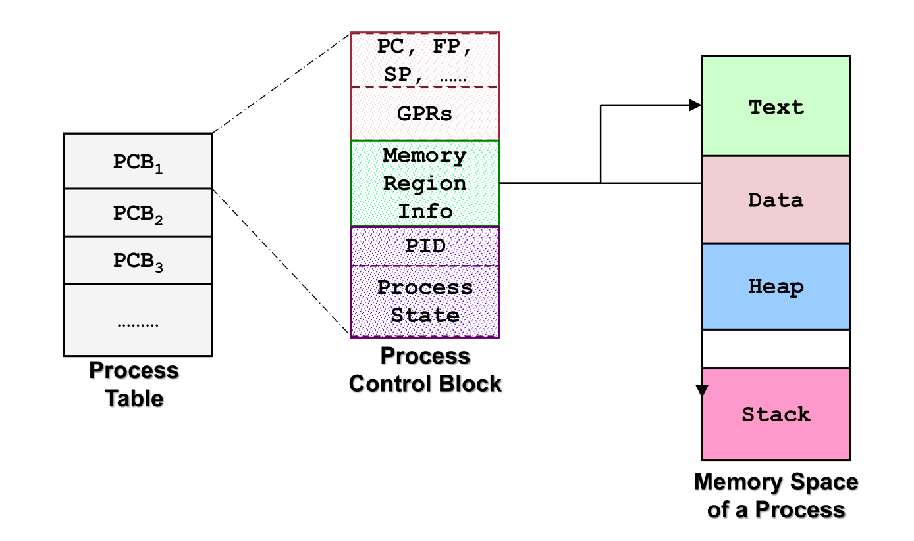

# 2 -- Process Abstraction

## Component descriptions

**Functional units**

**Registers:** GPR, Special registers (PC, Stack Pointer, Frame pointer)

### Basic Instruction Execution

1. Load instructions into "text"
2. PC set to first instruction location
3. Instruction exec loop (load memory, process via Functional Units, store memory)

## Function Calls

**Problems**: parameters, local variables, return value (we cannot just use the "data memory space" directly)

Challenges:

- control flow: after a return statement, how do we know location of instruction to return to?
  - basically, PC+4 values needs to be stored
- data: where do we store local variables? if recursion we don't know how much space to pre-allocate.

### Stack Memory for function invocations

Unlike other memory regions, stack memory can grow upwards.

After each return, we **pop** the returned frame from the stack.

{Return address, parameters, storage for local variables, SP, FP} $\subset$​ Stack Frame.

### Frame Pointer

FP @ fixed location in **each stack frame**. e.g. to access some value: `lw (FP - x)` Needs to be saved as well to return to after a frame is popped off the stack.

### Function call convention (no universal way!)

- Prepare for a call
  - **Caller:** Pass parameters using registers and/or stack
  - **Caller:** Return PC saved on stack
- Transfer of control (caller --> callee)
  - **Callee:** Save the old stack pointer (SP), old frame pointer (FP)
  - **Callee:** Allocate space for local variables
  - **Callee:** Move SP to new stack top, FP to new location in frame.

### Stack frame teardown

- After return
  - **Callee:** Result into register
  - **Callee:** Restore saved SP, FP
- Transfer of control (callee --> caller)
- Execution continued.

### Saved Registers

What if we have more variables than registers? **Register spilling** allows saving some variables to memory and fetching them when needed. e.g. Functions can spill registers it intends to use locally before the function starts. After returning function, restore those registers from memory.

## Dynamic memory allocation

i.e. Acquired memory space during execution time. Can we use "Data" or "Stack" memory?

- *Size not known* during compilation (NO DATA)
- No *de-alloc timing*, can be freed by garbage collecting (NO STACK)
- Thus we need to manage the **HEAP**.
  - Variable size, allocation/deallocation timing.
  - Memory management will be covered later (how to deal with "holes" in heap memory after deallocating non-contiguous memory?)

## Process Management

Allowing multiple programs to share hardware usage. We need to allow switching between $A$ and $B$.

### Abstraction of program (Process)

Information required to describe a running program:

- Memory context:
  - Text, Data, Stack, Heap
- Hardware context:
  - Registers, PC, SP, FP
- OS context:
  - Process properties, Resources used

## Process ID (PID) and State

### PIDs are unique process IDs in a machine.

- PIDs are reusable as long as no other running process shares this ID.
- max processes = max unique PID count
- reserved PIDs (kernel)

### A process can be running OR not-running. These are the two possible states.

A process can also be ready to run, but not actually executing.

### Process model

## System calls - The OS' API

### Purpose

- Well-defined, safe implementation of system operations
- Prevent from directly manipulating hardware devices (safety)
- Request for services via **interrupts**

Changes from user to (privileged) kernel mode. Different OS has different API.

In C/C++ the system call can almost be invoked **directly** (library version of the call with same name & params, acts as ***function wrapper***). Other than that the **library functions** acts as a ***function adapter***.

### Mechanism

1. Program invokes library call
2. Library call puts system call number in e.g. register
3. **TRAP** instruction to switch from user to kernel mode.
4. System call handler is determined.
   1. Save CPU context
   2. System call number as index
   3. Handled by **dispatcher**
5. System call handler executed
6. System call handler ends
   1. Restore CPU context
   2. Return library call
   3. Kernel to user mode.
7. Library call returns to program.

### Process Control Block/Process Table

The entire execution context of a process. Kernel maintains all processes' PCB.

- Scalability: How many process can you run concurrently at max?
- Efficiency: How to provide efficient access with minimum space wasted?

## Exceptions and errors

- Synchronous: Happens every time instruction executes
- Asynchronous: Caused by external event (I/O, Timer)

### Exception

Synchronous, happens at runtime due to program execution. An exception handler is then executed. `echo $?` prints the exit status of the last command.

- Segfault: e.g. trying to change a character of a constant string `char*`, or dereferencing a `NULL` location
- Divide by 0

### Interrupt

Asynchronous, external events can interrupt the execution of a program. An interrupt handler is then executed. Happens independent of program execution, due to I/O etc.