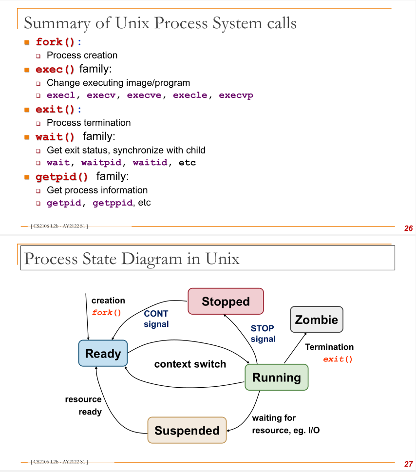

# 2b -- Process Abstraction in Unix

### Zombie Processes

- process that has completed execution (`exit`ed) but has an entry in the process table.
- the child process' entry is still required to allow the parent to read it's exit status. 
- after `wait` reads the child process' exit status, it is "reaped" and removed.
  - if parent dies before zombie reaped, zombie becomes child of `init` and `wait()` called by `init` periodically cleans up.

### Orphan Processes

- parent process terminates before child.
- `init` process (which is the first process that boots in a Unix system) becomes the pseudo-parent of child.
  - `wait()` called by `init` periodically cleans up.

### Process creation: `fork()`

- under `<unistd.h>`
- Creates a new child process, a **duplicate** of the current executable image.
  - Memory space is copied, not referenced.
  - returns 0 if child, PID if parent.

### New program execution

- `execl, execlp, execle, execv, execvp, execvpe` for different parameters
- `argc`: number of command line arguments
- `argv` `char*` string array. Each element in in `argv[]` is a character string. `arg[0]` is always the program name.

`excel` replaces currently executing process image with a new one. 

```c
int main() {
	execl( "/bin/ls", "ls", "-al", NULL);
} // executes "ls -al"
```

### The master process `init` (PID  =  1)

Fork creates the process tree from the most common ancestor (PID = 1). **Adopts orphaned** processes and continues running until shutdown.

### Process Termination in Unix: `exit`

- under `<stdlib.h>`
- returning `result` from `main()` implicitly calls `exit(result)` (open files are also flushed automatically)

### Parent/Child synchronization (waiting)

`wait(int *status)` returns the PID of the terminated child process. `status` contains exit status of terminated child (and other stuff too!!!). `NULL` if you don't need this info. `waitid()` suspends until the child specified by the PID argument **changes state**.

- parent blocks until **at least one** child terminates
- remainder of child system resources is cleaned up (remove all zombie process)
- does not block if no child.



Running --> Ready: When the OS decides you are taking up too much CPU time, you will be sent back to the ready queue

## Memory copy

- Creates address space of child process & allocates the new PID + entry in process table.
- Copies memory regions from parent
  - Program Data Stack
    - **Copy on Write:** Duplicates a memory location only when written to. Otherwise only store by reference.
    - Memory is organized into memory pages, and managed on a page level not location.
- Shared resources, hardware context, scheduler queued.

## References
[On the differences between `fork`, `vfork`, `exec`, `clone`](https://stackoverflow.com/questions/4856255/the-difference-between-fork-vfork-exec-and-clone)
